.. _understanding:

=====================================
Understanding the EMDB-SFF Data Model
=====================================

.. contents::

We present a brief synopsis of the data model by outlining the fields and attributes of each entity in the model. You can find the full schema documentation at [LINK]. For each entity we have included a screenshot of the entity’s structure.

The :doc:`developing` guide shows how to create and manipulate corresponding Python objects.

Top Level: An EMDB-SFF Segmentation
=======================================

An EMDB-SFF segmentation is structured as follows:

At the top level, a **segmentation** has the following attributes.

.. image:: segmentation.png

*  the **version** of the EMDB-SFF schema 
*  the **name** of the segmentation - free text
*  a **software** description (see :ref:`software`)
*  a list of **transforms** (see :ref:`transformation_matrix`)
*  a **primary descriptor** field - an indication of the primary geometrical descriptor. The only permitted values are **meshList**, **threeDVolume** or **shapePrimitiveList**.
*  the dimensions of the regions **bounding box** (see :ref:`bounding_box`)
*  a list of **global external references** (see :ref:`global_external_references`) a list of **segments** (see :ref:`segments`)
*  a list of **lattices** (see :ref:`lattices`)
*  free text **details** describing the segmentation

.. _software:

Software
========

The **software** is described by three fields:

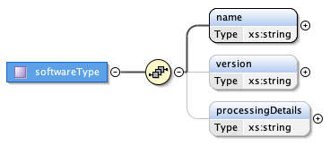

*  the **name** of the software application used to generate the segmentation
*  the software’s **version**
*  the **processing details** by which the segmentation was produced in free text

.. _transformation_matrix:

Transformation Matrix
========================

Each **transform** is a **transformation matrix** consisting of four fields:

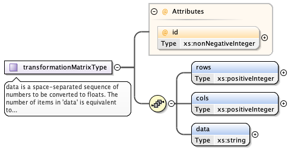

*   the transform **index** attribute - a unique integer value over all transforms
*   the number of **rows**
*   the number of **columns**, and
*   a space-separated string of the **data** in the matrix

.. _bounding_box:

Bounding Box
================

The **bounding box** consists of *minimum* and *maximum* x, y and z values defining the extent of the bounding box (``xmin``, ``xmax``, ``ymin``, ``ymax``, ``zmin``, ``zmax``)

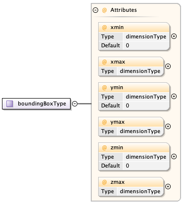

.. _global_external_references:

Global External References and External References
================================================================

A **global external reference** consists of a set of fixed descriptors by which the overall segmentation may be described. They are distinct from but similar to external references which apply to single segments i.e. a global external reference is to the segmentation while a (local) external reference is to a segment. To make concrete how these are specified, we will use the example of EMPIAR-10070. Suppose we wish to annotate our segmentation (not segment) with this entry. Then the corresponding global external reference will have the following fields.

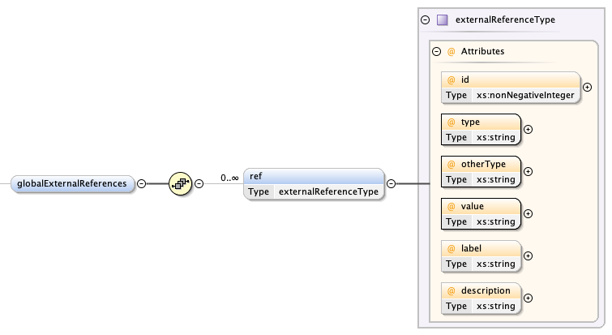

*	the **type** is the name of the resource - from our example this will be "empiar" (case-sensitive). Other examples are "go" for Gene Ontology, "emdb" for EMDB (see :ref:`resources` for the full list of supported resources)
*	the **otherType** is either a URI or IRI at which the accession (see **value**) is accessible) - from our example this would be https://www.ebi.ac.uk/pdbe/emdb/empiar/entry/10070/
*	the **value** is the complete accession - from our example this is ``"10070"``
*	the optional **label** is a string associated with this entry; for EMPIAR-10070 this is the title of the entry "Focused Ion Beam-Scanning Electron Microscopy of mitochondrial reticulum in murine skeletal muscle", and
*	the optional **description** is an auxiliary string of the entry; for EMPIAR entries this is the imaging modality "FIB-SEM"

.. _segments:

Segments
================

A **segment** is a complex structure consisting of the following top-level entities:

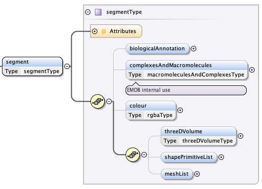

*	a **biological annotation** description (see :ref:`biological_annotation`)
*	the **colour** of the segment in arithmetic ``rgba``
*   a collection of **complex and macromolecule** IDs (for internal use - see :ref:`complexes_and_macromolecules`)
*	an optional list of **meshes** (see :ref:`meshes`)
*	an optional **3D volume** description (see :ref:`volumes`)
*	an optional list of **shape primitives** (see :ref:`shapes`)

.. _biological_annotation:

Segments: Biological Annotation
--------------------------------

The **biological annotation** consists of the following fields:

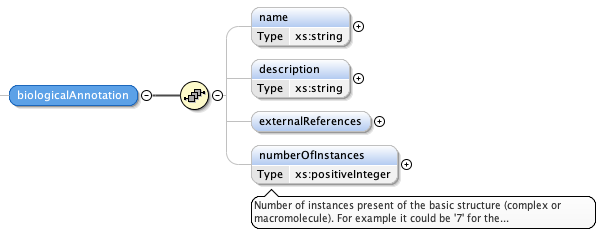

*	the **name** of the segment as a free text string
*	a **description** of the segment as a free text string
*	a numerical indication of the **number of instances** of this segment; this has a default value of one (1)
* 	a list of **external references** similar to global external references described in :ref:`global_external_references`

.. _complexes_and_macromolecules:

Segments: Complexes and Macromolecules
----------------------------------------------------------------

The collection of **complex and macromolecules** is split into two independent lists:

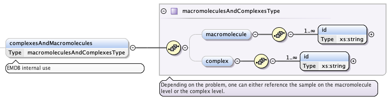

*	a list of **complex** IDs as strings
*	a list of **macromolecule** IDs as strings

.. _meshes:

Segments: Meshes
--------------------------------

A **mesh** has three fields, each of which are further structured:

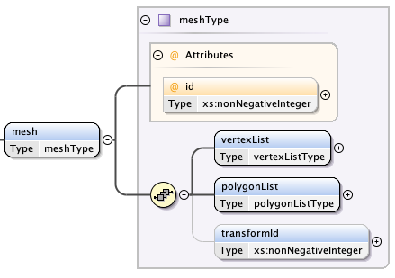

*	a list of **vertices** which define the surface geometry (see `Segments: Mesh Vertex`_)
*	a list of **polygons** which define the surface topology (see `Segments: Mesh Polygon`_)
*	an optional **transform index** (from :ref:`transformation_matrix`)

.. _vertex:

Segments: Mesh Vertex
~~~~~~~~~~~~~~~~~~~~~~

A **vertex** consists of five values:

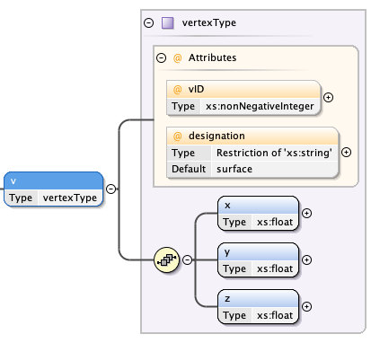

*	an **index** attribute - a unique integer value over all vertices
*	a **designation** attribute of either "surface" or "normal" to define the type of vertex
*	an **x** value
*	a **y** value, and
*	a **z** value

.. _polygon:

Segments: Mesh Polygon
~~~~~~~~~~~~~~~~~~~~~~

A **polygon** has four or more attributes

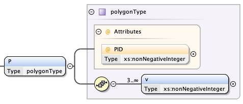

*	an **index** attribute - a unique integer value over all polygons
*	three or more **vertex indexes** (see `Segments: Mesh Vertex`)

.. _volumes:

Segments: 3D Volumes
--------------------------------

A **3D volume** consists of three fields:

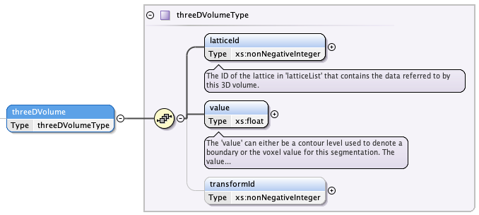

*	the **lattice index** containing the volume data (see :ref:`lattices`)
*	the **voxel value** that identifies this 3D volume segment in the lattice specified in :ref:`lattices`
*	an optional **transform index** (from :ref:`transformation_matrix`)

.. _lattices:

Lattices
~~~~~~~~~~~~~~~~~~~~~~

A **lattice** describes a 3D structure consisting of orthogonally stacked voxels that has the following fields:

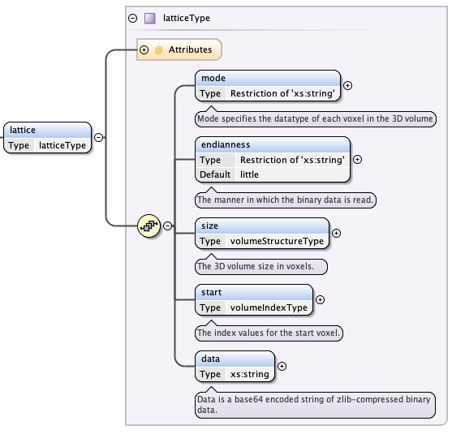

*	a **lattice index** - a unique integer over all lattices
*	a **mode** string which specifies the data type of each voxel; valid values are "int8", "uint8", "int16", "uint16", "int32", "uint32", "int64", "uint64", "float32", "float64"
*	the **endianness** of the lattice data; can be "little" or "big" (case-sensitive)
*	the **size** of the lattice (see :ref:`size`)
*	the **start** indices of the lattice (see :ref:`start`)
*	the **data** as a base64-encoded, zlib-zipped byte sequence

.. _size:

Lattice: Volume Size
+++++++++++++++++++++

The **size** has three fields:

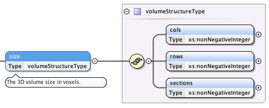

*	the number of **columns** as a non-negative integer
*	the number of **rows** as a non-negative integer
*	the number of **sections** as a non-negative integer

.. _start:

Lattice: Start Index
+++++++++++++++++++++

The **start** indices have three fields:

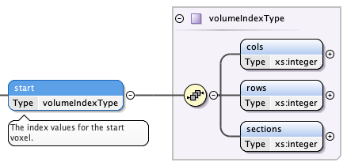

*	the 0-based **column index** of the first voxel - an integer
*	the 0-based **row index** of the first voxel - an integer
*	the 0-based **section index** of the first voxel - an integer

.. _shapes:

Segments: Shape Primitives
--------------------------------

There are different types of **shape primitives**. Each shape primitive has:

*  an **index** - a unique integer value over all shape types

**cones** have:

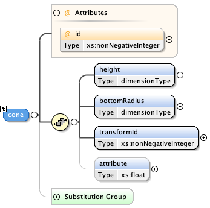

*  a **height**
*  a **bottom radius**
*  an optional **transform index** (from :ref:`transformation_matrix`)
*  an optional **attribute value** - a floating point number associated with the shape

**cuboids** have:

.. image:: cuboid.png

*  **x** extent
*  **y** extent
*  **z** extent
*  an optional **transform index** (from :ref:`transformation_matrix`)
*  an optional **attribute value** - a floating point number associated with the shape

**cylinders** have:

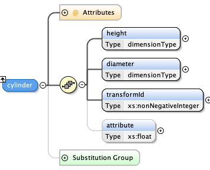

*	a **height**
*	a **diameter**
*	an optional **transform index** (from :ref:`transformation_matrix`)
*	an optional **attribute value** - a floating point number associated with the shape

**ellipsoids** have:

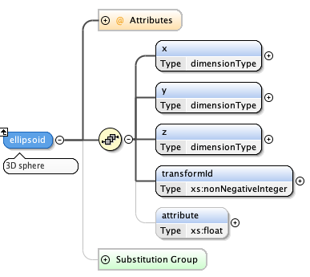

*   **x** extent
*   **y** extent
*   **z** extent
*	an optional **transform index** (from :ref:`transformation_matrix`)
*	an optional **attribute value** - a floating point number associated with the shape

**subtomogram averages** are exactly the same as 3D volumes and have:

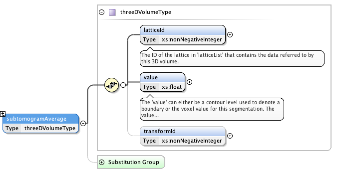

*	the **lattice index** containing the volume data (see :ref:`lattices`)
*	the **voxel value** that specifies the recommended contour level in the lattice specified in :ref:`lattices`
*	an optional **transform index** (from :ref:`transformation_matrix`)

.. warning::

	This element has not been implemented in ``sfftk-rw``.

.. _resources:

Resources for External References
========================================
Here is a partial list of resources that may be used for (global) external references. Note that the main means by which these would be obtained is either using the ``sfftk notes`` utility or the online SAT (https://wwwdev.ebi.ac.uk/pdbe/emdb/sat_branch/sat/).

+-----------------------------------------------------------------------+---------------+-----------------------------------------------------------------+-----------------------+------------------------+-----------------------+
| **Name**                                                              | **type**      | **otherType**                                                   | **value**             | **label**              | **description**       |
+=======================================================================+===============+=================================================================+=======================+========================+=======================+
| Ontologies available through EMBL-EBI’s Ontology Lookup Service (OLS) | <ontology_id> | http://purl.obolibrary.org/obo/<accession>                      | <accession>           | ``label`` field        | ``description`` field |
+-----------------------------------------------------------------------+---------------+-----------------------------------------------------------------+-----------------------+------------------------+-----------------------+
| Gene Ontology (GO)                                                    | go            | http://purl.obolibrary.org/obo/<GO_accession>                   | <GO_accession>        | ``label`` field        | ``description`` field |
+-----------------------------------------------------------------------+---------------+-----------------------------------------------------------------+-----------------------+------------------------+-----------------------+
| Electron Microscopy DataBank (EMDB)                                   | emdb          | https://www.ebi.ac.uk/pdbe/entry/emdb/<EMDB_accession>          | <EMDB_accession>      | ``search_term``        | ``title`` field       |
+-----------------------------------------------------------------------+---------------+-----------------------------------------------------------------+-----------------------+------------------------+-----------------------+
| UniProt                                                               | uniprot       | https://www.uniprot.org/uniprot/<UniProt_accession>             | <UniProt_accession>   | ``name`` field         | ``proteins`` field    |
+-----------------------------------------------------------------------+---------------+-----------------------------------------------------------------+-----------------------+------------------------+-----------------------+
| Protein Data Bank                                                     | pdb           | https://www.ebi.ac.uk/pdbe/entry/pdb/<PDB_accession>            | <PDB_accession>       | ``search_term``        | ``title`` field       |
+-----------------------------------------------------------------------+---------------+-----------------------------------------------------------------+-----------------------+------------------------+-----------------------+
| Europe PMC                                                            | europepmc     | https://europepmc.org/abstract/MED/<EuropePMC_accession>        | <EuropePMC_accession> | ``authorString`` field | ``title`` field       |
+-----------------------------------------------------------------------+---------------+-----------------------------------------------------------------+-----------------------+------------------------+-----------------------+
| Electron Microscopy Public Image ARchive (EMPIAR)                     | empiar        | https://www.ebi.ac.uk/pdbe/emdb/empiar/entry/<EMPIAR_accession> | <EMPIAR_accession>    | ``search_term``        | ``title`` field       |
+-----------------------------------------------------------------------+---------------+-----------------------------------------------------------------+-----------------------+------------------------+-----------------------+

